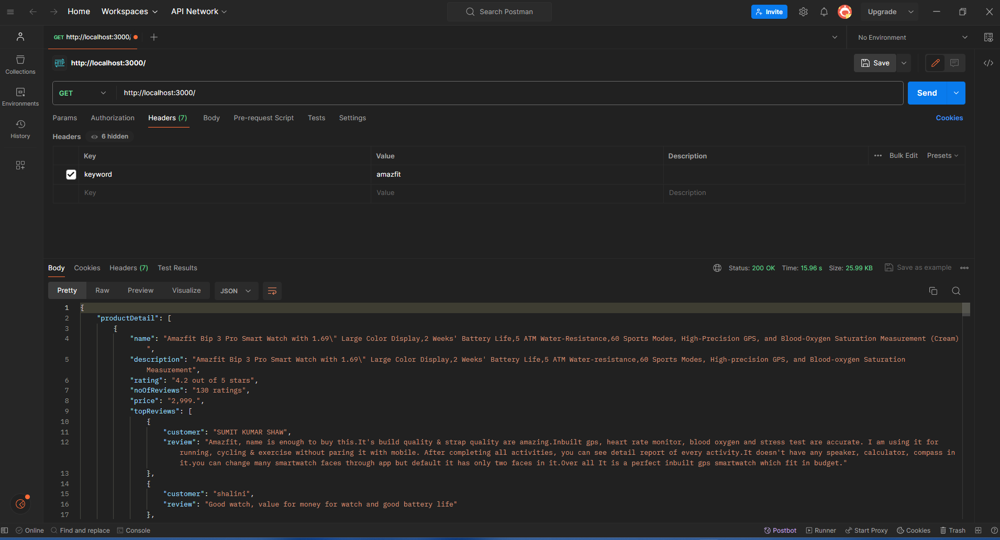

# Amazon Product Details Retrieval

## Description

This Node.js application utilizes Puppeteer to fetch product details from Amazon based on a provided keyword. It returns information such as product name, description, rating, number of reviews, price, and optional top 10 customer reviews.

## Getting Started

1. **Clone the repository:**

    ```bash
    git clone https://github.com/manosatpathy/an-app-using-puppeteer.git
    ```

2. **Install dependencies:**

    ```bash
    npm install
    ```

3. **Run the application:**

    ```bash
    npm start
    ```

    The application will start on port 3000 by default.

## Usage

### API Endpoint

- **Endpoint:** `GET /`
- **Header:**
    - `keyword`: The keyword to search for on Amazon.

### Screenshot


